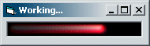



## Application busy graphic \- knight rider effect

### Description

Nice little graphic for activating when your application is busy. Uses alphablend, gdialphablend and bitblt. background doesn't have to be black and you can use a different image too.
 
### More Info
 

             |
---                |---
**Submitted On**   |2003-11-26 07:54:02
**By**             |[Fosters](https://github.com/Planet-Source-Code/PSCIndex/blob/master/ByAuthor/fosters.md)
**Level**          |Intermediate
**User Rating**    |4.9 (59 globes from 12 users)
**Compatibility**  |VB 5\.0, VB 6\.0
**Category**       |[Graphics](https://github.com/Planet-Source-Code/PSCIndex/blob/master/ByCategory/graphics__1-46.md)
**World**          |[Visual Basic](https://github.com/Planet-Source-Code/PSCIndex/blob/master/ByWorld/visual-basic.md)
**Archive File**   |[Applicatio16764111262003\.zip](https://github.com/Planet-Source-Code/fosters-application-busy-graphic-knight-rider-effect__1-50135/archive/master.zip)

